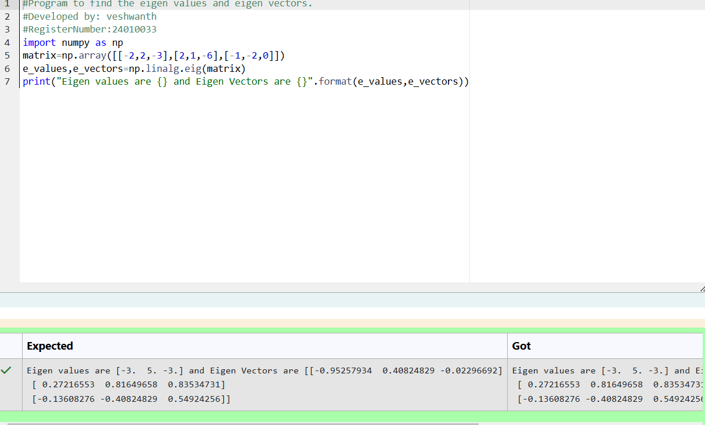
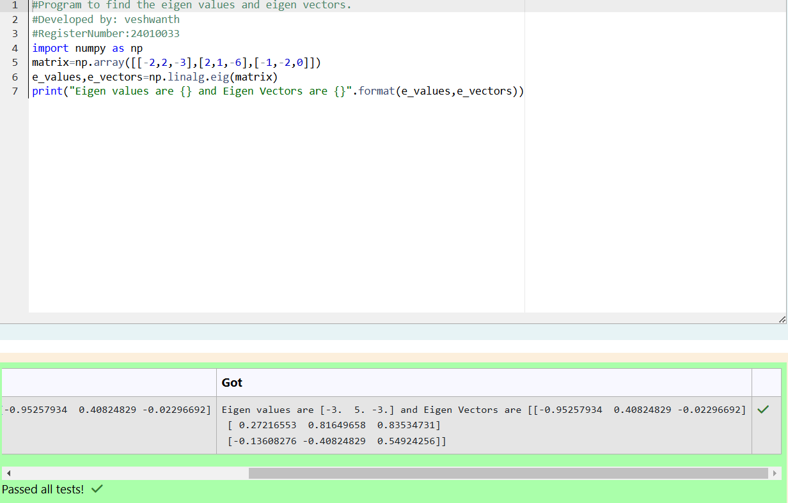

# EIGENVALUES-AND-EIGENVECTORS
## Aim:
To write a python program to find the Eigenvalues and Eigen Vectors
## Equipment’s required:
1. 	Hardware – PCs
2. 	Anaconda – Python 3.7 Installation / Moodle-Code Runner
## Algorithm:
### Step1 : Import numpy as np from python library.
### Step 2: Get the array input from the user and input the value as nested list.
### Step 3: Using the np.linalg.eig(),  we get two results (first is eigenvalue and second is eigenvector) of the given matrix.
### Step 4:print the e_values and e_vectors to get desired output. 

## Program:

```
#Program to find the eigen values and eigen vectors.
#Developed by: veshwanth
#RegisterNumber:24010033
import numpy as np
matrix=np.array([[-2,2,-3],[2,1,-6],[-1,-2,0]])
e_values,e_vectors=np.linalg.eig(matrix)
print("Eigen values are {} and Eigen Vectors are {}".format(e_values,e_vectors))

```

## Output:



## Result:
Thus the Eigenvalue and Eigenvector is successfully solved using python program
